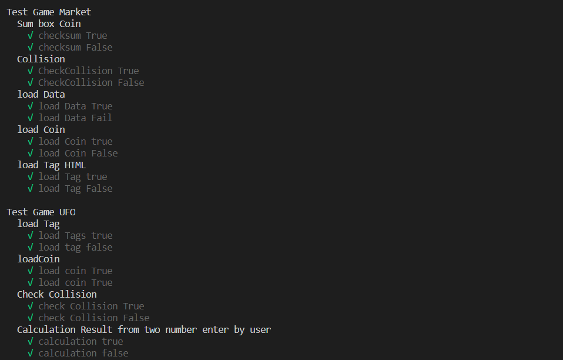
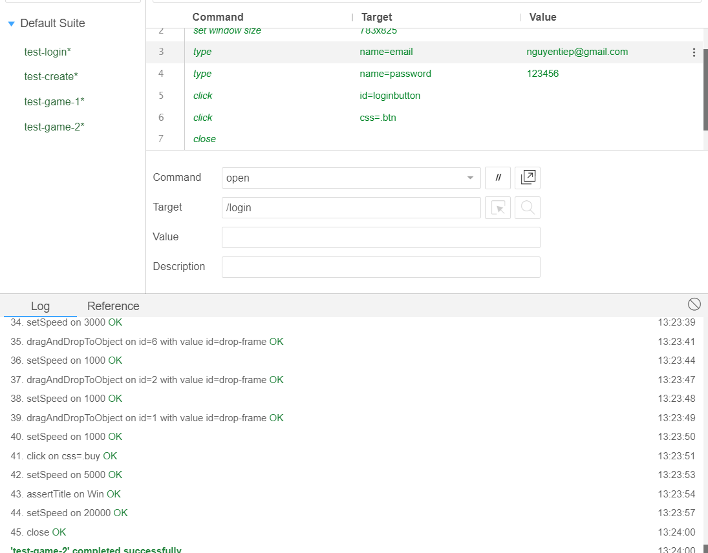
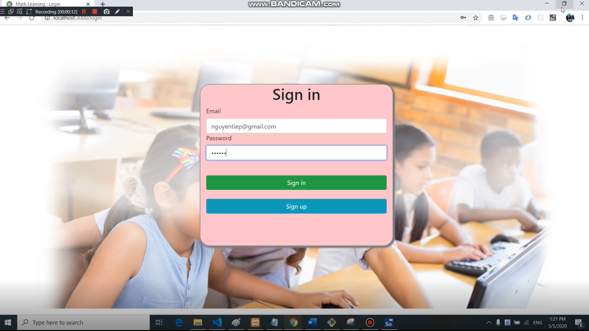

# Test 
## Unit Test
### Tech
`mocha
chai
mocha-jsdom`
### run
`npm test`
### Description 
1. Test Suite
a) Test Game UFO
    - load Tag : Load thẻ khi bắt đầu vào game
    - loadCoin : Load coin khi bắt đầu chơi game và qua màn
    - Check Collision : kiểm tra va chạm
    - Calculation Result from two number enter by user : Kiểm tra kết quả người dùng nhập vào và kết quả đầu bài
b) Test Game Market
    - Sum box Coin : Kiểm tra tổng của 2 coin
    - Collision : Kiểm tra va chạm
    - load Data : load dữ liệu khi vào game
    - load Coin : loai coin khi vào màn chơi
    - load Tag HTML : Load các thẻ cần xứ lý
2. Code
        describe('Test Game Market', () => {
            describe('Sum box Coin', () => {

                it('checksum True', () => {
                    var box_coin = [2, 3, 3];
                    expect(codeMarket.sumBoxCoin(box_coin)).to.equal(8);
                })
                it('checksum False', () => {
                    var box_coin = [2, 3, 3];
                    expect(codeMarket.sumBoxCoin(box_coin)).to.not.equal(7);
                })
            })
        })

3. Kết quả
    

## E2E Test
### Tech
 - Selenium IDE
### Description 
1. Test suite
 - Test Login
 - Test Create
 - Test game UFO 
 - Test game Market
 2. Code (minh hoạ)
        describe('Suite Test Math learning', function() {
            this.timeout(30000)
            let driver
            let vars
            beforeEach(async function() {
                driver = await new Builder().forBrowser('chrome').usingServer('http://localhost:4444/wd/hub').build()
                vars = {}
            })
            afterEach(async function() {
                await driver.quit();
            })
            it('test-open', async function() {
                await driver.get("http://localhost:3000//")
                await driver.manage().window().setRect(746, 824)
                await driver.findElement(By.css(".btn")).click()
            })
            it('test-login-fail', async function() {
                await driver.get("http://localhost:3000//login")
                await driver.findElement(By.name("email")).sendKeys("nguyentiep132@gmail.com")
                await driver.findElement(By.name("password")).sendKeys("1312311")
                await driver.findElement(By.id("loginbutton")).click()
                assert(await driver.findElement(By.css(".alert")).getText() == "Account Invalid")
            })
        })
3. *Hình ảnh*
        
4. *Video*
        [)](https://jlpt-learning.herokuapp.com/file/video/upload_d6ea6a5e200e190c204c5fc089082ea6.mp4)
